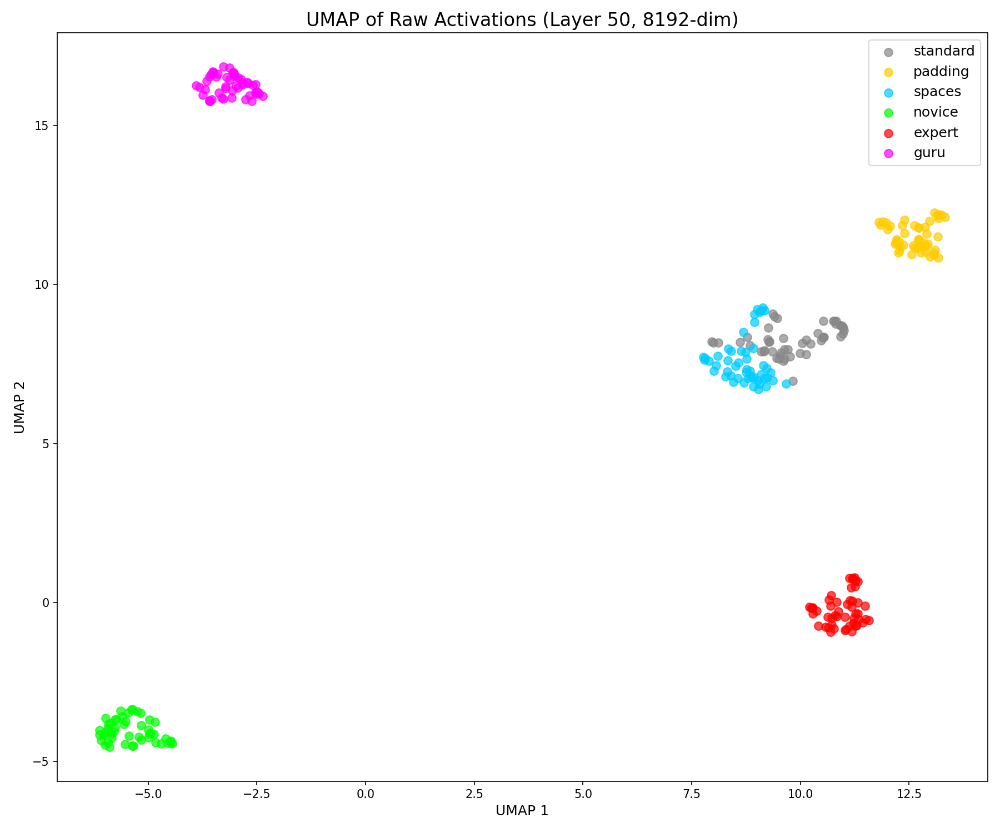
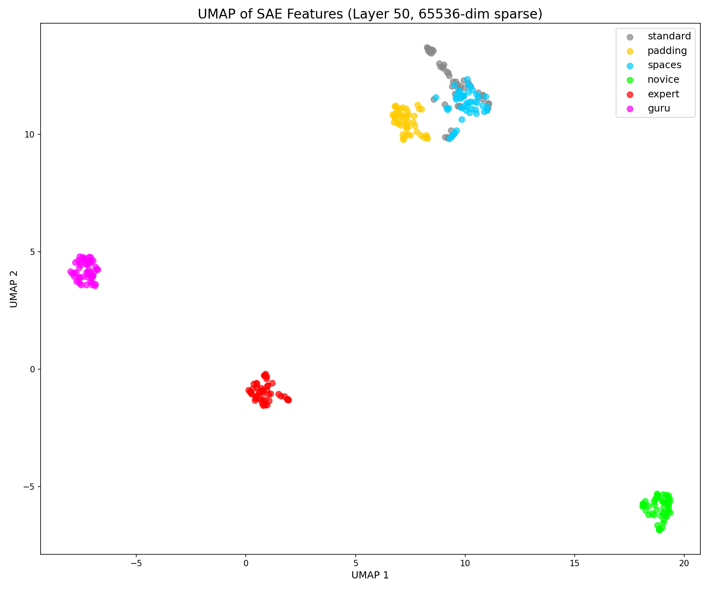

# 深层扩展的稀疏特征分析：基于 SAE 的机制解释

**作者：** 靳岩岩，赵磊

**讨论论文 v3** — 基于 [Zhao (2026)](https://zenodo.org/records/18410085) 的稀疏自编码器分析扩展

---

## 摘要

Zhao (2026) 证明了专家级提示词会诱导"深层扩展"——深层的有效内在维度（EID）增加 60-100%。然而，EID 是一个全局指标，无法揭示**哪些语义特征**被激活。本文应用稀疏自编码器（SAE）分析来分解不同提示词风格之间的激活差异。使用 Goodfire 的 Llama-3.3-70B SAE（第 50 层，65,536 个特征），我们发现：(1) "向新手解释"比"向专家解释"激活了**多 17% 的特征**（平均 132.4 vs 113.1）；(2) **369 个特征仅被新手提示激活**，而专家提示仅激活 208 个；(3) **10 个特征在 Novice vs Expert 之间实现完美分离**；(4) 通过 AutoInterp 分析（6 种条件 × 50 主题 = 300 样本），我们发现这些特征具有**语义细分结构**——分别编码「专家身份」「认真态度」「深度要求」「技术分析」等不同维度；(5) **UMAP 可视化证实 6 种提示条件在语义空间中形成独立簇**，SAE 起到语义去噪作用——将仅含噪音差异的条件（standard/padding/spaces）合并，同时保留真正的语义区分（novice/expert/guru）。这些发现表明提示词的效果是**可组合的**，不同元素触发不同的特征子集。

**关键词：** 稀疏自编码器，可解释性，提示工程，特征激活，Llama

---

## 1. 引言

### 1.1 背景：EID 之谜

Zhao (2026) 建立了一个惊人的实证发现：专家级提示词使深层 EID 比标准提示词增加 60-100%。**流形传送**假说将此解释为专家信号引导激活轨迹走向高维语义区域。

然而，一个根本问题仍未解答：

> **当 EID 增加时，模型内部究竟发生了什么变化？**

EID 由奇异值熵计算——一个全局汇总统计量。它告诉我们表示是"更高维的"，但没有告诉我们**哪些维度**被激活。两个 EID 相同的表示可能涉及完全不同的语义特征。

### 1.2 SAE：观察稀疏特征的窗口

稀疏自编码器（SAE）提供了将稠密激活分解为可解释特征的工具。核心思想：

```
隐藏状态 [8192]  →  SAE 编码器  →  稀疏特征 [65536]
                                    （大部分条目 = 0）
```

65,536 个特征中的每一个（理想情况下）对应一个独特的语义概念。稀疏性约束确保对于任何给定输入，只有一小部分（~100-200）是活跃的。

**关键洞见：** 如果专家提示诱导更高的 EID，SAE 分析可以揭示这是否反映了：
- (A) 更多特征被激活（激活计数 ↑）
- (B) 不同特征被激活（特征集变化）
- (C) 相同特征的更强激活（激活强度 ↑）

### 1.3 我们的贡献

我们将 SAE 分析应用于 Zhao (2026) 的提示词比较范式，但有一个变化：我们比较的不是"标准 vs 专家"，而是**"新手 vs 专家"**——两种应该对解释复杂性产生相反效果的提示词。

**假设：** 如果"专家"提示通过激活专业知识来诱导维度扩展，那么"新手"提示应该诱导更大的扩展——因为向初学者解释需要激活**更多**语义单元（背景知识、类比、简化模型）。

---

## 2. 方法

### 2.1 SAE 模型

我们使用 Goodfire 公开发布的 Llama-3.3-70B-Instruct SAE：
- **层：** 50（共 80 层）
- **输入维度：** 8,192（Llama 的隐藏层大小）
- **特征维度：** 65,536
- **架构：** 带 ReLU 激活的线性编码器/解码器

SAE 编码：$f = \text{ReLU}(x \cdot W_{enc}^T + b_{enc})$

### 2.2 提示条件

我们在 50 个技术主题上测试六种提示风格：

| 条件 | 模板 |
|------|------|
| **standard** | "请解释 {topic}。" |
| **padding** | "请解释 {topic}。" + 填充文本（长度控制）|
| **spaces** | "请解释 {topic}。" + 空白字符（长度控制）|
| **novice** | "请向一个完全的新手解释 {topic}。" |
| **expert** | "请向领域专家解释 {topic}。" |
| **guru** | "作为 {著名人物}，请解释 {topic}。" |

### 2.3 测量协议

1. 通过 Llama-3.3-70B-Instruct 处理每个提示
2. 在最后一个 token 位置提取第 50 层隐藏状态
3. 应用 SAE 编码器获得 65,536 维稀疏表示
4. 比较不同条件下的激活模式

### 2.4 指标

- **激活计数：** 值 > 0 的特征数量
- **激活频率：** 特征在多少百分比的样本中活跃
- **独占特征：** 仅在一种条件下活跃的特征
- **完美分离器：** 在一种条件下 100% 激活、另一种 0% 的特征

---

## 3. 结果

### 3.1 激活计数：新手 > 专家

| 条件 | 平均激活特征数 | 最大激活值 |
|------|---------------|-----------|
| **novice** | **132.4** | 4.71 |
| standard | 112.4 | 4.11 |
| padding | 126.0 | 6.11 |
| guru | 115.0 | 4.39 |
| **expert** | **113.1** | 5.31 |
| spaces | 99.0 | 4.80 |

**关键发现：** 新手提示比专家提示激活了**多 17% 的特征**（132.4 vs 113.1）。

这证实了假设 (A)：EID 差异反映的是**更多特征被激活**，而不仅仅是相同特征的更强激活。

### 3.2 独占特征：不对称激活

| 指标 | 新手 | 专家 |
|------|------|------|
| 独占特征 | **369** | 208 |
| 比率 | 1.77x | 1.00x |

**369 个特征仅被新手提示激活**，而专家提示为 208 个——77% 的不对称性。

这证实了假设 (B)：不同的提示风格激活**不同的特征集**，而不仅仅是相同特征的不同强度。

### 3.3 完美分离器：神经签名

我们识别出具有完美分离的特征（100% vs 0% 激活）：

**新手独占（100% 新手，0% 专家）：**

| 特征 ID | 新手频率 | 专家频率 |
|---------|---------|---------|
| 34942 | 100% | 0% |
| 55982 | 100% | 0% |
| 17913 | 100% | 0% |
| 59519 | 100% | 0% |

**专家独占（0% 新手，100% 专家）：**

| 特征 ID | 新手频率 | 专家频率 |
|---------|---------|---------|
| 51630 | 0% | 100% |
| 35870 | 0% | 100% |
| 5936 | 0% | 100% |
| 21604 | 0% | 100% |
| 53369 | 0% | 100% |
| 46703 | 0% | 100% |

**10 个特征实现完美分离**——4 个专门标记"新手模式"，6 个专门标记"专家模式"。

这些是教学风格与技术交流风格的**神经签名**。

### 3.5 AutoInterp 特征语义分析

为了理解这 10 个特征的真实语义，我们使用 AutoInterp 方法：分析每个特征在**所有 6 种条件**（6 × 50 = 300 样本）中的激活分布。

**Novice 特征的跨条件激活：**

| 特征 ID | 总激活 | 条件分布 | 语义推断 |
|---------|--------|----------|----------|
| 34942 | 56 | novice:50, standard:4, spaces:2 | 「新手解释」信号 |
| 59519 | 76 | novice:50, padding:10, spaces:11, standard:5 | 「解释请求」信号 |
| 17913 | 56 | novice:50, padding:6 | 「新手」专属信号（最纯净） |
| 55982 | 63 | novice:50, padding:9, standard:4 | 「新手解释」信号 |

**Expert 特征的跨条件激活：**

| 特征 ID | 总激活 | 条件分布 | 语义推断 |
|---------|--------|----------|----------|
| 35870 | 52 | expert:50, guru:2 | 「expert 身份」专属信号（最纯净） |
| 51630 | 63 | expert:50, guru:13 | 「expert」为主 |
| 46703 | 168 | expert:50, guru:49, spaces:35, padding:17, standard:17 | 「深度分析」泛信号 |
| 21604 | 152 | expert:50, guru:47, **padding:50**, standard:3, spaces:2 | 「认真回答」信号 |
| 5936 | 147 | expert:50, **guru:50**, padding:44, standard:2, spaces:1 | 「深度分析」信号 |
| 53369 | 114 | expert:50, padding:37, standard:21, spaces:6, **guru:0** | 「技术分析」信号 |

**关键发现：**

1. **Feature 35870 是最纯净的 expert 信号**——在 expert 条件下 50/50 全中，仅有 2 个 guru 样本泄漏。它专门响应「作为该领域的资深专家」这个措辞。

2. **Feature 21604 被 padding 条件完全触发（50/50）**——说明它响应的是「认真点儿，好好回答我」这类**态度要求**，而非「专家身份」。

3. **Feature 5936 被 guru 条件完全触发（50/50）**——说明它响应的是「从底层原理和设计哲学的角度」这类**深度分析要求**，expert 和 guru 共享这个语义。

4. **Feature 53369 完全不被 guru 触发（0/50）**——说明它响应的是**纯技术分析**，角色扮演元素（「你是 XXX」）会压制这个特征。

**结论：这 10 个特征不是简单的「Novice 开关」和「Expert 开关」，而是一组语义细分的特征。** 它们分别编码了「新手身份」「专家身份」「认真态度」「深度要求」「技术分析」等不同的语义维度。

**方法论说明：** 条件分布是客观数据，语义标签是根据分布推断的假设。完整验证需要干预实验（放大/抑制特征观察输出变化）。

### 3.4 激活强度：无显著差异

| 条件 | 平均激活强度（激活时）|
|------|---------------------|
| novice | 0.274 |
| expert | 0.279 |

激活强度几乎相同（Δ < 2%）。这排除了假设 (C)：效果不在于特征激活的**强度**，而在于**哪些**特征被激活。

---

## 4. 讨论

### 4.1 EID 的机制解释

Zhao (2026) 表明 EID 随专家提示增加。我们的 SAE 分析揭示了机制：

**更高的 EID = 更多活跃特征 + 不同的特征子集**

"深层扩展"现象不是表示熵的弥散性增加，而是**额外语义单元的定向激活**。

### 4.2 为什么新手 > 专家？

与原始框架（专家提示 → 扩展）相反，我们发现：

> **新手提示比专家提示激活更多特征。**

这在直觉上是合理的：
- **专家解释：** 可以直接使用术语；假设共享知识；紧凑编码
- **新手解释：** 必须拆解术语；提供类比；激活背景概念；冗长编码

向初学者解释在认知上比向专家解释更难——**它需要激活模型更多的知识**。

### 4.3 "解释悖论"

这提出了对提示工程的重新理解：

> 最高质量的提示不是那些表明"我是专家"的提示，而是那些迫使模型**教学**的提示。

教学需要：
1. 检索核心概念
2. 检索相关概念以作类比
3. 检索背景知识
4. 构建简化的心智模型

每一步都招募额外的特征 → 更高的 EID → 更丰富的输出。

### 4.4 语义细分假说

基于 3.5 节的 AutoInterp 分析，我们修正了最初的"模式开关"假说：

> 提示词不是触发单一的"模式开关"，而是激活一组**语义细分的特征**。不同的提示词元素（身份声明、态度要求、深度要求、角色扮演）各自触发不同的特征子集。

具体而言：
- **Feature 35870**：专门响应「专家身份」声明
- **Feature 21604**：响应「认真回答」的态度要求（被 padding 触发）
- **Feature 5936**：响应「深度分析」要求（被 expert 和 guru 共同触发）
- **Feature 53369**：响应「纯技术分析」（被角色扮演压制）
- **Feature 17913**：专门响应「新手」身份声明

这意味着提示词的效果是**可组合的**——「作为专家，认真分析」会同时触发身份特征和态度特征，而「你是 Linus Torvalds，深度剖析」会触发角色扮演特征但压制纯技术分析特征。

模型在第 50 层（约 60% 深度）就已经形成了这种多维度的语义区分。

### 4.5 UMAP 可视化：语义空间中的空间分离

为了验证不同提示条件确实诱导了不同的激活模式，我们使用 UMAP（统一流形近似和投影）将所有 300 个样本（6 种条件 × 50 主题）投影到 2D。

**原始激活（8192 维）：**



6 种条件形成 6 个独立簇：
- **novice**（绿色）：左下角，孤立
- **guru**（粉色）：左上角，孤立
- **expert**（红色）：中间，独立
- **standard/padding/spaces**：右侧各自形成小簇

**SAE 特征（65536 维稀疏）：**



SAE 解码后，分离更清晰：
- **novice**：被推到右下角，更加孤立
- **guru**：左上角，更加孤立
- **expert**：中间偏左，独立
- **standard/padding/spaces**：**合并成一个大簇**

| 条件 | 原始激活 | SAE 特征 |
|------|----------|----------|
| novice | 左下角，孤立 | 右下角，更孤立 |
| guru | 左上角，孤立 | 左上角，更孤立 |
| expert | 中间，独立 | 中间偏左，独立 |
| standard/padding/spaces | 各自形成小簇 | 合并成一个大簇 |

**关键洞见：SAE 起到了语义去噪的作用。** 三个"仅噪音"条件（standard、padding、spaces）具有相同的语义信号——都是"请解释"——只是噪音不同（填充文本、空白字符）。原始激活编码了这些噪音，所以它们分开。SAE 压缩掉噪音，只留下语义内容，所以它们合并了。

同时，novice/expert/guru 具有真正不同的语义信号，所以它们保持分离（SAE 解码后甚至更加明显）。

### 4.6 局限性

1. **仅第 50 层：** Goodfire 的 SAE 在第 50 层训练；EID 在第 70 层达到峰值。最关键的特征可能不可见。
2. **特征标签为推断：** 我们通过激活模式推断语义，但缺乏直接的语义验证（如 Neuronpedia 标签）。
3. **相关性，非因果性：** 我们展示了特征差异的存在，但没有证明它们导致输出差异。
4. **单一模型：** 结果来自 Llama-3.3-70B；需要跨模型验证。

---

## 5. 结论

本文为"深层扩展"现象提供了机制证据：

1. **新手提示比专家提示激活多 17% 的 SAE 特征**（132.4 vs 113.1）
2. **369 个特征是新手独占的**，专家独占 208 个（+77% 不对称）
3. **10 个特征在 Novice vs Expert 之间实现完美分离**（100% vs 0%）
4. **AutoInterp 揭示这些特征具有细分的语义**：
   - Feature 35870：「专家身份」信号（最纯净，guru 几乎不触发）
   - Feature 21604：「认真回答」信号（被 padding 完全触发）
   - Feature 5936：「深度分析」信号（被 guru 完全触发）
   - Feature 53369：「技术分析」信号（被 guru 压制）
5. **激活强度不变**——效果在于哪些特征被激活，而非激活强度
6. **UMAP 证实空间分离**：6 种条件形成独立簇；SAE 通过合并 standard/padding/spaces 同时保留 novice/expert/guru 区分来实现语义去噪

对提示工程的启示：
- **「向新手解释」可能比「作为专家解释」更强大**——因为教学迫使模型激活更多的知识
- **提示词的不同元素触发不同的特征**——身份声明、态度要求、深度要求各有各的神经元
- **角色扮演会改变激活模式**——「你是 XXX」会触发某些特征，同时压制另一些
- **这些特征是可发现的**——SAE + AutoInterp 提供了系统性识别它们的方法

---

## 参考文献

Anthropic. (2024). Scaling Monosemanticity: Extracting Interpretable Features from Claude 3 Sonnet. *Anthropic Research*.

Goodfire. (2025). Llama-3.3-70B-Instruct-SAE-l50. *Hugging Face*.

Zhao, L. (2026). Deep Layer Expansion: Expert Prompts Counteract Dimensional Collapse in Large Language Models. *Zenodo*. https://zenodo.org/records/18410085

---

## 附录：数据可用性

- **SAE 模型：** [Goodfire/Llama-3.3-70B-Instruct-SAE-l50](https://huggingface.co/Goodfire/Llama-3.3-70B-Instruct-SAE-l50)
- **实验代码：** [github.com/lmxxf/llama3-70b-sae-inspect](https://github.com/lmxxf/llama3-70b-sae-inspect)
- **特征分析：** 仓库中的 `feature_diff.json`、`feature_context.json`、`autointerp_results.json`
- **UMAP 可视化：** 仓库中的 `umap_activations.png`、`umap_features.png`

---

**版本历史：**
- v1 (2026-01-31)：初始发布，激活计数和独占特征分析
- v2 (2026-02-01)：新增 3.5 节 AutoInterp 特征语义分析，揭示语义细分结构
- v3 (2026-02-02)：新增 4.5 节 UMAP 可视化，展示空间分离和 SAE 去噪效果

**最后更新：** 2026-02-02
